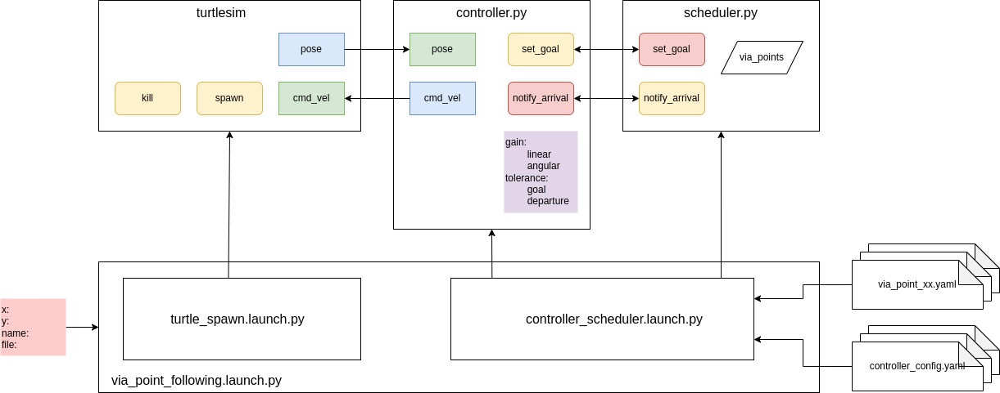

# turtlesim_control

"turtlesim_control" is an all-in-one example ROS2 custom package that displays various basic functionalities of ROS2.   
In this branch, none of "launch" functionalities is available.

## Installation
1.) Clone the repo to the src directory of your workspace. You must unzip and put each folder in the src directory.

2.) Build "turtlesim_control" and "turtlesim_interfaces" in your workspace.
```
cd ~/[your_workspace]
colcon build --packages-select turtlesim_control turtlesim_interfaces
source install/setup.bash
```
## Testing out turtlesim_control

1.) Terminal 1: Run turtlesim_node
```
ros2 run turtlesim turtlesim_node
```

2.) Terminal 2: Start a controller

```
ros2 run turtlesim_control controller.py --ros-args -r __ns:=/turtle1 -p angular_gain:=10.0
```

3.) Terminal 3: Start & run a scheduler (change the workspace name in the command)

```
ros2 run turtlesim_control scheduler.py --ros-args -r __ns:=/turtle1 -f ~/[your_ws]/src/turtlesim_control/via_point/via_point_01.yaml
```

4.) Terminal 4 & 5: While running those 3 terminals, you can monitor the heartbeat from each custom node 
```
ros2 topic echo /turtle1/enable_status
ros2 topic echo /turtle1/scheduler/index
```

## Exercise
# turtlesim_plus
<p align="center">
  
</p>

You are tasked to create at least 1 Launch file that can do the following.

1.) Launch turtlesim_node, controller.py, and scheduler.py

2.) Take 4 optional Launch arguments
  * name:name of the turtle [default:turtle1]
  * file:name of the via point file in "via point" directory [default:via_point_01.yaml]
  * x: spawn location in x-direction [default:5.444444]
  * y: spawn location in y-direction [default:5.444444]

3.) When turtlesim_node starts, kill any existing turtle in turtlesim, then spawn a new one with the given name and location.

4.) Pass a configuration file to the controller node as ROS parameters.
  * The base configuration file must be for any generic controller (without the namespace).
  * The base configuration conists of 'linear_gain','angular_gain',and 'tolerance'
  * controller:{ros__parameters:{linear_gain:1.0,angular_gain:5.0,tolerance:0.2}} [The parameters in the diagram are incorrect.]
  * The passed configuration must be the modified version of the based configuration file (with added namespace).

5.) Pass the full path to the via point file in the "via_point" directory of the package based on the given name to the scheduler.

6.) Name the Launch file "via_point_following.launch.py"

Also create 'config' directory as 'controller_config.yaml' in that directory.
